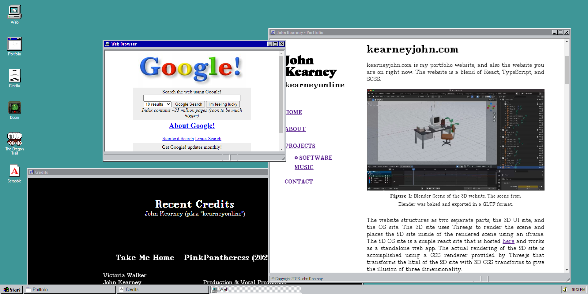

# kearneyjohn.com-OS

This is one of two repositories created for my portfolio website, [kearneyjohn.com](https://kearneyjohn.com). If you are looking for the Three.js desk setup UI and iFrame content, please see [kearneyjohn.com-UI](https://github.com/JohnKearney1/kearneyjohn.com-UI)



This is a standalone React app that is used to display a partial "emulation" of the Windows 95 UI. There are a few preset applications that can display a portfolio, host a resume download, display a contact form and procedurally send emails when used in conjunction with the server from [kearneyjohn.com-UI](https://github.com/JohnKearney1/kearneyjohn.com-UI).

The site also has a few implementations of JS-DOS games that can be played in the browser. These games are not my own, but are open source and can be found on [js-dos.com](https://js-dos.com/).

Play DOOM!

# About

To setup a dev environment:
```bash
# Clone the repository

# Install dependencies 
npm i

# Run the local dev server
npm run start
```

To serve a production build:

```bash
# Install dependencies if not already done
npi i

# Build for production
npm run build

# Serve the build using express
npm start
# or
npm start
```